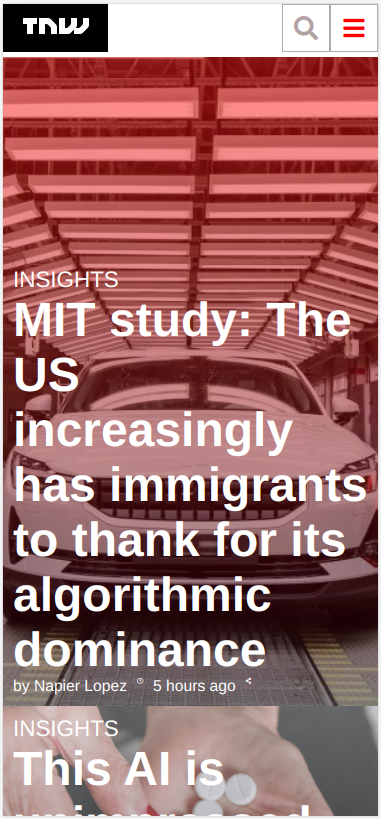

# TheNextWeb_Clone
We will be cloninig TheNextWeb to make it responsive aiming to use media queries to degrade their site as the window size is reduced.

# TheNextWeb_Clone

> This project aims to TheNexWeb. Fully responsive for SM, MD y LG devices, such as smartphone, iPad and desktop screen. Use of media queries for breakpoints and Fontawesome for the icons! I used Flexbox and Grid applied for positioning
CSS linters issues addressed

Additional description about the project and its features.

## Built With

- HTML5
- CSS

## Live Demo

[Live Demo Link](https://angelacuahutle.github.io/TheNextWeb_Clone/)

## Getting Started

To get a local copy up and running follow these simple example steps.

### Prerequisites

### Setup

### Install

### Usage

### Run tests

### Deployment

## Authors

👤 **Author1**

- GitHub: [@githubhandle](https://github.com/angelacuahutle)
- Twitter: [@twitterhandle](https://twitter.com/AngelaCunaDev)
- LinkedIn: [LinkedIn]()

👤 **Author2**

## 🤝 Contributing

Contributions, issues, and feature requests are welcome!

Feel free to check the [issues page](https://github.com/angelacuahutle/TheNextWeb_Clone/issues/1#issue-751109118).

## Show your support

Give a ⭐️ if you like this project!

## Acknowledgments

- Hat tip to anyone whose code was used
- Inspiration
- etc

## 📝 License

This project is [MIT](lic.url) licensed.

# TheNextWeb_Clone

> This project aims to TheNexWeb. Fully responsive for SM, MD y LG devices, such as smartphone, iPad and desktop screen. Use of media queries for breakpoints and Fontawesome for the icons! I used Flexbox and Grid applied for positioning
CSS linters issues addressed

Additional description about the project and its features.

## Built With

- HTML5
- CSS

## Live Demo

[Live Demo Link](https://angelacuahutle.github.io/TheNextWeb_Clone/)

## Getting Started

To get a local copy up and running follow these simple example steps.

### Prerequisites

### Setup

### Install

### Usage

### Run tests

### Deployment

## Authors

👤 **Author1**

- GitHub: [@githubhandle](https://github.com/angelacuahutle)
- Twitter: [@twitterhandle](https://twitter.com/AngelaCunaDev)
- LinkedIn: [LinkedIn]()

👤 **Author2**

## 🤝 Contributing

Contributions, issues, and feature requests are welcome!

Feel free to check the [issues page](https://github.com/angelacuahutle/TheNextWeb_Clone/issues/1#issue-751109118).

## Show your support

Give a ⭐️ if you like this project!

## Acknowledgments

- Hat tip to anyone whose code was used
- Inspiration
- etc

## 📝 License

This project is [MIT](lic.url) licensed.
